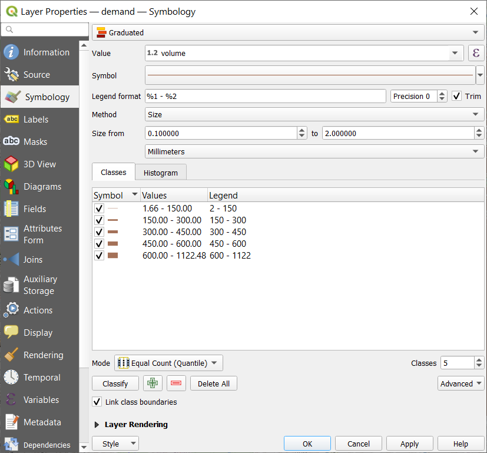

**GRID2DEMAND: A tool for generating zone-to-zone travel demand based on grid
zones**

**1. What is GRID2DEMAND?**

GRID2DEMAND is a quick trip generation and distribution tool based on the
four-step travel model. First, the research region is divided into grid zones of
the same scale. POI nodes are used to generate node production/attraction.
Second, trip distribution is achieved by a typical gravity model.

**1.1. Data files**

Input files are the network files in GMNS format (*node.csv, link.csv,
poi.csv*), which can be automatically generated by the OSM2GMNS tool. Node and
POI files will be used for generating demand, and *poi.csv* may need manual
edition.

Output files are *zone.csv, accessibility.csv, poi_trip_rate.csv,* and
*demand.csv*. Final zone-to-zone demand is listed in *demand.csv* with geometry.

**1.2. Grid partition**

Grids are automatically generated by a given scale of degree or number of zones
in the research region. Each grid is regarded as TAZ used for trip generation
and distribution. The grid information is stored in *zone.csv*.

**1.3. Node demand**

All types of POI nodes are collected from *poi.csv*. The values of production
and attraction under each trip purpose and POI type are defined by default or by
users. Therefore, the production and attraction values of each node can be
calculated. The POI node production/attraction rates used in the model are
summarized in *poi_trip_rate.csv*. The node information is updated in
*node.csv*.

**1.4. Accessibility**

Accessibility is measured by zone-to-zone distance according to zone centroid
coordinates. A degree at different latitudes represents different lengths on a
flat surface. According to a given latitude, the closest latitude in the
following table is selected to calculate the longitudinal length.

**1.5. Gravity model**

For each OD pair, a typical gravity model is applied to calculate zone-to-zone
demand volume.

The framework of GRID2DEMAND is illustrated in the following figure.

**2. How to use GRID2DEMAND?**

We will use University of Maryland, College Park as an example to illustrate how
to use GRID2DEMAND.

**Step 1: Determine the research boundary and download .osm file from
OpenStreetMap**

Adjust the map to the location of interest and click on the Export1 button on
the top.

Then, obtain the latitude and longitude coordinates (users can manually select a
different area2). Lastly, click on the Export3 button found in the middle of the
navigator to download an OSM data file. For a very large area of interest, users
need to click the link of “Overpass API” to obtain a map file.

**Step 2: Execute OSM2GMNS to get network files in GMNS format**

Open the Python IDE such as Pycharm for a typical configuration. Then, OSM2GMNS
converts *map.osm* file in OSM format into a network file in GMNS format.

Please note that *poi.csv* may need to be edited manually in case of information
loss。

**Step 3: Execute GRID2DEMAND Python code**

Configurate working dictionary in the Python IDE (e.g., Pycharm). Then, execute
GRID2DEMAND to get zone-to-zone demand, generating four files which are
highlighted in blue.

**Step 4: Visualization in QGIS**

Open QGIS and add Delimited Text Layer of the output files.

Then Open the Properties window of the demand layer. Set the symbology as
graduated symbols by size.

Zone-to-zone demand can be visualized with a base map.

