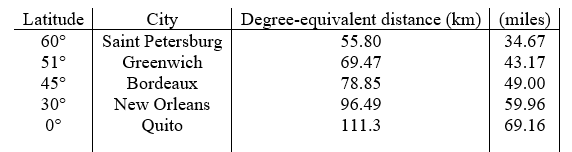
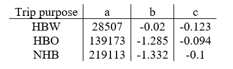

# **Grid2demand**

GRID2DEMAND: A tool for generating zone-to-zone travel demand based on grid cells or TAZs and gravity model

- [**Grid2demand**](#grid2demand)
  - [**Code Examples**](#code-examples)
    - [**Installation**](#installation)
    - [**Simple Example**](#simple-example)
      - [**Generate Demand with node.csv and poi.csv**](#generate-demand-with-nodecsv-and-poicsv)
    - [**Call for Contributions**](#call-for-contributions)
    - [**Citing grid2demand**](#citing-grid2demand)
  - [**Starting with Grid2demand - Learning Sources**](#starting-with-grid2demand---learning-sources)
  - [**Introduction and Background Knowledge**](#introduction-and-background-knowledge)
    - [**4-step transportation forecasting**](#4-step-transportation-forecasting)
    - [**Productions and Attractions**](#productions-and-attractions)
    - [**Estimate Trip Productions/Attractions Using Trip Rates**](#estimate-trip-productionsattractions-using-trip-rates)
    - [**Accessibility**](#accessibility)
    - [**Trip distribution**](#trip-distribution)
  - [**What is grid2demand - the open-source package**](#what-is-grid2demand---the-open-source-package)
    - [**Flowchart of grid2demand**](#flowchart-of-grid2demand)
    - [**Grid partition and zone creation**](#grid-partition-and-zone-creation)
    - [**Trip generation**](#trip-generation)
    - [**Accessibility and distance computing**](#accessibility-and-distance-computing)
    - [**Trip distribution**](#trip-distribution-1)
    - [**OD demand estimation using link counts and different data sources**](#od-demand-estimation-using-link-counts-and-different-data-sources)
  - [**Quick Implementation and Visualization**](#quick-implementation-and-visualization)

## **Code Examples**

### **Installation**

```python
pip install grid2demand
```

If you meet installation issues, please refer to the [user guide](https://github.com/asu-trans-ai-lab/grid2demand) for solutions.

### **Simple Example**

#### **Generate Demand with node.csv and poi.csv**

1. Create zone from node.csv (the boundary of nodes), this will generate grid cells (num_x_blocks, num_y_blocks, or x length and y length in km for each grid cell)
2. Generate demands for between zones (utilize nodes and pois)

```python
from __future__ import absolute_import
import grid2demand as gd

if __name__ == "__main__":

    # Specify input directory
    input_dir = "your-data-folder"

    # Initialize a GRID2DEMAND object
    net = gd.GRID2DEMAND(input_dir=input_dir)

    # load network: node and poi
    net.load_network()

    # Generate zone dictionary from node dictionary by specifying number of x blocks and y blocks
    net.net2zone(num_x_blocks=10, num_y_blocks=10)
    # net.net2zone(cell_width=10, cell_height=10, unit="km")

    # Calculate demand by running gravity model
    net.run_gravity_model()

    # Save demand, zone, updated node, updated poi to csv
    net.save_results_to_csv()
```

### **Call for Contributions**

The grid2demand project welcomes your expertise and enthusiasm!

Small improvements or fixes are always appreciated. If you are considering larger contributions to the source code, please contact us through email: [Xiangyong Luo](mailto:luoxiangyong01@gmail.com), [Dr. Xuesong Simon Zhou](mailto:xzhou74@asu.edu)

Writing code isn't the only way to contribute to grid2demand. You can also:

- review pull requests
- help us stay on top of new and old issues
- develop tutorials, presentations, and other educational materials
- develop graphic design for our brand assets and promotional materials
- translate website content
- help with outreach and onboard new contributors
- write grant proposals and help with other fundraising efforts

For more information about the ways you can contribute to grid2demand, visit [our GitHub](https://github.com/asu-trans-ai-lab/grid2demand). If you' re unsure where to start or how your skills fit in, reach out! You can ask by opening a new issue or leaving a comment on a relevant issue that is already open on GitHub.

### **Citing grid2demand**

If you use grid2demand in your research please use the following BibTeX entry:

Xiangyong Luo, Dustin Carlino, and Xuesong Simon Zhou. (2023). [xyluo25/grid2demand](https://github.com/xyluo25/grid2demand/): Zenodo. https://doi.org/10.5281/zenodo.11212556

## **Starting with Grid2demand - Learning Sources**

- How to quickly generate **initial origin-destination transportation demand** for engaging traffic simulation games such as A/B street and DTALite?
- How to teach our undergraduate students the important **trip generation and trip distribution steps**, using their own beautiful campus as examples?
- How to analyze the resident locations and other land use properties using flexible **grid zones, based on POI data from OpenStreetMap** data and using **open transportation modeling format**


If you have not used Grid2demand before, here are some advices to get started.

1. Read the user guide or watch the video at https://www.youtube.com/watch?v=EfjCERQQGTs.

2. Obtain a map.osm or map.osm.pbf file for your area of interest at https://extract.bbbike.org/ or openstreetmap.org

3. Look at the examples at Google colab environment https://github.com/asu-trans-ai-lab/grid2demand/blob/main/grid2demand_tutorial.ipynb

4. Install Python, Grid2demand and QGIS on your computer or using Google Colab environment to modify one of the examples to implement your own model.

5. Post your questions on the users group:

     GitHub: https://github.com/asu-trans-ai-lab/grid2demand/issues

     Google: groups.google.com/d/forum/grid2demand

Open-source tool of grid2demand aims to provide an open-source quick demand generation python package, which can work anywhere in the world, thanks to open data from [OpenStreetMap](Openstreetmap) users.

To know more about this tool, please check out the 3rd mini teaching lesson in our podcast series [https://www.youtube.com/watch?v=EfjCERQQGTs](https://www.youtube.com/watch?v=EfjCERQQGTs).

Gird2demand is an open-source trip generation and distribution tool for teaching transportation planning and applications. It generates zone-to-zone travel demand based on alphanumeric grid zones. Users can obtain zone-to-zone and
node-to-node travel demand with a few lines of python code based on OpenStreetMap and OSM2GMNS.

For the python source code and sample network files, readers can visit the project homepage at ASU Trans+AI Lab Github
([https://github.com/asu-trans-ai-lab/grid2demand](https://github.com/asu-trans-ai-lab/grid2demand)). The Jupyter notebook example can be found at
[https://github.com/asu-trans-ai-lab/grid2demand/blob/main/grid2demand.ipynb](https://github.com/asu-trans-ai-lab/grid2demand/blob/main/grid2demand_tutorial.ipynb), which is also accessible through Google Colab.

Mini teaching lesson: [https://www.youtube.com/watch?v=EfjCERQQGTs](https://www.youtube.com/watch?v=EfjCERQQGTs)

## **Introduction and Background Knowledge**

### **4-step transportation forecasting**

Trip generation and trip distribution are the first 2 steps in the larger context of the 4-step process in transportation planning. The standard four steps are briefly described below.

- Trip Generation: Estimate how many trips enter or leave a zone/traffic-analysis-zone (TAZ)
- Trip Distribution: Estimate how many trips from each zone/TAZ end in all zones/TAZs
- Mode Choice: Estimate which travel-method is used (e.g., vehicle, transit, walk) to complete those trips
- Traffic Assignment: Distribute vehicles/traffic flow to different paths during travel


Trip generation is a procedure that uses socioeconomic data (e.g., household size, income, etc.) to estimate the number of person trips for a modeled time period (e.g., daily, peak hour) at a Traffic Analysis Zone (TAZ) level. A person trip involves a single person leaving from an origin and arriving at a single destination, and each trip has a classification/purpose based on typical
classification such as home-based-work (HBW), home-based-other (HBO), and non-home-based (NHB).


In the four-step process, there are two typical methods used to predict trips based on attributes:

- [Trip rate method based on regression equations](#id.rjox6xhc6knq)
- [Cross-classification using category-based trip rates](#id.2d2g6gayq4ya)

After estimating the total number of trips produced, the trips are often separated by different purposes (e.g., HBW, HBO, NHB).

An alternative approach to modeling trips is to model tours, which can be thought of as a series of linked trips. Tours are typically used in Activity-Based Models (ABM), where daily travel activities are generated based on activity patterns for households.

### **Productions and Attractions**

In trip-based transportation planning, for a home-based trip, a production is related to the home end/location, while an attraction is related to the non-home end/location. For a non-home-based trip, a production is related to the origin location, and an attraction is related to the destination location. Trips entering and leaving a zone should balance - if a person leaves a zone, they
should also return; if a person enters a zone, they should also leave.

For example, if a person travels from home to work and then from work to home on a certain day, then 2 home-based work trip productions are generated at the home TAZ, and two attractions related at his or her work location TAZ.

### **Estimate Trip Productions/Attractions Using Trip Rates**

Productions are typically modeled as a function of population and/or number of households, as well as income levels or auto ownership. Other explanatory variables might be used, such as the number of workers, but we need to make sure explanatory variables are often not interrelated and correlated with each other.

Attractions are often modeled as a function of the number of households and/or number of employees, where employment may be broken down by different types (e.g., retail, office, service, and other). Again, other explanatory variables can also be used, such as commercial floor space or CBD (Central Business District) variables, but the same checks for correlation between variables should be utilized. Attractions tend to be more difficult to measure/estimate, and we tend to have less trust in these estimates. For more information, users can read [NCHRP Report 365: “Travel Estimation Techniques, CH 3 trip
generation](http://www.google.com/url?q=http%3A%2F%2Fntl.bts.gov%2Flib%2F21000%2F21500%2F21563%2FPB99126724.pdf&sa=D&sntz=1&usg=AFQjCNG2L127sploJ1a6_-ZmhSt6PnNypA) and [NCHRP Report 716: Travel Demand Forecasting: Parameters and Techniques, CH
4.4 Trip Generation](http://onlinepubs.trb.org/onlinepubs/nchrp/nchrp_rpt_716.pdf).

### **Accessibility**

In transportation planning, accessibility is first defined as the potential of opportunities for traveler interaction. the potential opportunity for traveler interaction is positively associated with accessibility. Typically, accessibility captures the extent of the attractiveness of each potential destination and some researchers represent accessibility as the amount of activity locations potentially reachable within a given travel time or distance from an origin location.

One of the goals of transportation system construction and management is to improve individuals’ accessibility or the ease of reaching desired activities, destinations, and services. In general, quantitative accessibility measures describe how many and how easily destinations can be reached from a particular zone. For more information, users can check [https://tfresource.org/topics/Accessibility.html](https://tfresource.org/topics/Accessibility.html).

### **Trip distribution**

There are a variety of trip distribution formulations. Among recent travel models, two formulations dominate: the gravity model and the destination choice model.


For each OD pair, a typical gravity model is applied to calculate zone-to-zone demand volume. In the gravity model, the trips produced at an origin and attracted to a destination are directly proportional to the total trip productions at the origin and the total attractions at the destination with "friction factor", which represents the reluctance or impedance of persons to
make trips of various duration or distances. A gravity model may be “singly-constrained” or “doubly-constrained”. For more information, please visit https://tfresource.org/topics/Trip_distribution.html. and http://www.princeton.edu/~alaink/Orf467F12/The%20Gravity%20Model.pdf


For each OD pair, a **gravity model** to calculate zone-to-zone demand volume is formulated as follows.


## **What is grid2demand - the open-source package**

Grid2demand is a quick demand generation tool based on the trip generation and trip distribution methods of the standard 4-step travel model for teaching transportation planning and applications. By taking advantage of the OSM2GMNS tool to obtain a routable transportation network from OpenStreetMap, Grid2demand aims to further utilize Point of Interest (POI) data to construct a trip demand matrix aligned with standard travel models.

The area of interest is partitioned into an alphanumeric grid (also known as atlas grid), in which each cell is identified by a combination of a letter and a number. The trip generation step is performed at the POI node level using ITE
trip generation tables (https://www.ite.org/technical-resources/topics/trip-and-parking-generation/trip-generation-10th-edition-formats/) or other trip rate references.

When partitioning grid cells and calculating accessibility, World Geodetic System-1984 Coordinate System is applied to convert coordinates to length. The trip distribution is carried out using a typical gravity model. The data flow chart is illustrated in the following table and figure.

**Description of Data Files**

| Step | Process                            | Input File or Parameter                                                                    | Output File                                                                                                        | Method                                                                  |
| ---- | ---------------------------------- | ------------------------------------------------------------------------------------------ | ------------------------------------------------------------------------------------------------------------------ | ----------------------------------------------------------------------- |
| 0    | Network files preparation          | map file from OpenStreetMap                                                                | *node.csv, link.csv, poi.csv*                                                                                    | Osm2gmns tool                                                           |
| 1    | Input files reading                | *node.csv, poi.csv*                                                                      |                                                                                                                    |                                                                         |
| 2    | Zone generation and grid partition | Number of blocks or grid scales in meters with latitude of the area of interest (optional) | *zone,csv, poi.csv* (update with zone id)                                                                        | Alphanumeric grid                                                       |
| 3    | Trip generation                    | *poi_trip_rate.csv* (optional), trip purpose                                             | *poi_trip_rate.csv* (output/update with utilization notes), *node.csv* (update with zone id and demand values) | Trip rate method                                                        |
| 4    | Accessibility calculation          | *accessibility.csv* (optional), latitude of the area of interest                         | *accessibility.csv*                                                                                              | Simple straight-line distance between zone centroids                    |
| 5    | Trip distribution                  | Trip purpose, friction factor coefficients                                                 | *demand.csv, zone,csv* (update with total production and attraction in each zone)                                | Gravity model                                                           |
| 6    | Agent generation                   | *demand.csv*                                                                             | *agent.csv*                                                                                                      | Random sampling of node-to-node agents according to zone-to-zone demand |
| 7    | Visualization                      |                                                                                            | QGIS or NEXTA                                                                                                      |                                                                         |

### **Flowchart of grid2demand**


For the entire package, the input files include the network files in GMNS format (*node.csv, link.csv*) as well as *poi.csv*, generated by the OSM2GMNS tool.

Users can download a default *poi_trip_rate.csv* from
https://github.com/asu-trans-ai-lab/grid2demand/blob/main/examples/data_folder/poi_trip_rate.csv
and apply further adjustments based on local traffic conditions.

The final output files include *zone.csv, accessibility.csv*, *demand.csv* for zone-to-zone OD demand matrix, and *input_agent.csv* for node-to-node agent files which can be used by agent-based simulators such as AB Street and DTALite. Accordingly, *node.csv* and *poi.csv* are updated with assigned zone information.

### **Grid partition and zone creation**


To facilitate hierarchical and multi-resolution spatial computing, grid cells are used to aggregate trips to traffic analysis zones, while standard TAZs are typically defined based on census tracts. Users can specify the number of cells per row and per column or the width and height of each grid cell (in meters) for the area of interest. To maintain a consistent mapping, we use a fractional
value in terms of the degree at different latitudes to represent different lengths on a flat surface. That is, a value of 0.01 longitudinal degrees at 60 degrees latitude is equivalent to 0.558 km on a flat surface. Thus, users can provide a latitude value of the area of interest, and the software will identify the closest latitude in the following table and use the equivalent distance to
measure for that area.



Moreover, some nodes in the network are marked as boundary nodes in *node.csv* to describe the entrance or exit points with respect to the area of interest. Thus, we add virtual zones around the grid area’s boundary to aggregate demand from outside the area of interest, which are regarded as “gates” or external stations.

### **Trip generation**

To enable detailed modeling of trip generation from parking lots and buildings, different types of POI nodes are specifically covered in file *poi.csv*, extracted from the original *OSM file*. The user can supply more information in *poi.csv* in case of missing values. The trip generation process used in grid2demand has the following 3 sub-steps.

1. For each node, the amount of produced or attracted traffic is computed based on the underlying trip purpose and POI type, defined in *poi_trip_rate.csv.*
2. Update the field of production and attraction for each POI or boundary node in *node*.*csv*.
3. For each zone, its total production and attraction values can be calculated as the sum of node-based values across all nodes with the corresponding zone id.

A sample *poi_trip_rate* table is listed below.


For each boundary node (such as freeway or arterial’s endpoint at the boundary of the area) which stands for a gate to enter or leave the area, the default values of production and attraction are set to be 1000.

### **Accessibility and distance computing**

In the current version, accessibility is measured by zone-to-zone straight-line distance according to zone centroid coordinates. A more advanced version will be provided in the future to use the shortest path algorithm for computing end-to-end driving or multimodal travelling distance and costs.

### **Trip distribution**

As mentioned above, a typical gravity model is applied to calculate zone-to-zone demand volume. The trip purpose and friction factor coefficients can be defined by users or by default. The default values under three typical trip purposes are listed in the following table.



### **OD demand estimation using link counts and different data sources**

In the future, output *demand.csv* can act as one of multiple data sources for a hierarchical travel demand estimation and *input_agent.csv* can be directly used for assignment by DTALite and for other travel models. For more information,
please visit
https://www.researchgate.net/publication/325131295_Hierarchical_travel_demand_estimation_using_multiple_data_sources_A_forward_and_backward_propagation_algorithmic_framework_on_a_layered_computational_graph.

## **Quick Implementation and Visualization**

We will use the University of Maryland, College Park as an example to illustrate how to use grid2demand.

**Step 1: Installation**

You can install the latest release of grid2demand at [PyPI](https://pypi.org/project/pydriosm/) (https://pypi.org/project/grid2demand/) via [pip](https://packaging.python.org/key_projects/#pip):

\~\~\~\~\~\~\~\~\~\~\~\~\~\~\~\~\~\~\~\~\~\~\~\~\~\~\~\~\~\~\~\~\~\~\~\~\~\~\~\~\~\~\~\~\~\~\~\~\~\~\~\~\~\~\~\~\~\~\~\~\~\~\~

pip install grid2demand

\~\~\~\~\~\~\~\~\~\~\~\~\~\~\~\~\~\~\~\~\~\~\~\~\~\~\~\~\~\~\~\~\~\~\~\~\~\~\~\~\~\~\~\~\~\~\~\~\~\~\~\~\~\~\~\~\~\~\~\~\~\~\~

After running the command above, the grid2demand package along with two required dependency packages (numpy, pandas) will be installed on your computer (if they have not been installed yet).

**Step 2: Determine the boundary of interest and download .osm file from
OpenStreetMap (https://www.openstreetmap.org/)**

1. Adjust the map to the location of interest and click on the “Export” button on the top.


1. Obtain the latitude and longitude coordinates (users can “manually select a different area”).
2. Click on the “Export” button found in the middle of the navigator to download an OSM data file.
3. For a very large area of interest, users need to click the link of “Overpass API” to obtain a map file.


**Step 3: Execute OSM2GMNS to get network files in GMNS format**

Open the Python IDE, such as Pycharm, for a typical configuration. Then, use OSM2GMNS to convert the *map.osm* file in OSM format into a network file in GMNS format.

Notes: User guide for osm2gmns can be found at https://osm2gmns.readthedocs.io/en/latest/.


Please note that *poi.csv* might have different degrees of missing information.
Please supply additional accurate POI-type information if needed.

**Step 4: Execute grid2demand Python code**

1. **Import the package and read input network data**

\~\~\~\~\~\~\~\~\~\~\~\~\~\~\~\~\~\~\~\~\~\~\~\~\~\~\~\~\~\~\~\~\~\~\~\~\~\~\~\~\~\~\~\~\~\~\~\~\~\~\~\~\~\~\~\~\~\~\~\~\~\~\~

```python
import grid2demand as gd

input_dir = "Path-folder-to-your-node.csv-and-poi.csv"

net = gd.GRID2DEMAND(input_dir)
```

1. **Partition network into grid cells**

Users can customize the number of grid cells by setting “number_of_x_blocks” and
“number_of_y_blocks”. On the other hand, users can customize the cell’s width
and height in meters under the latitude of the area by setting “cell_width”,
“cell_height” and “latitude”).

By default, “cell_width” and “cell_height” are set as the length on a flat
surface under a specific latitude corresponding to the degree of 0.006
(equivalent to 400 meters or 0.25 miles at latitude = 45 degree).

\~\~\~\~\~\~\~\~\~\~\~\~\~\~\~\~\~\~\~\~\~\~\~\~\~\~\~\~\~\~\~\~\~\~\~\~\~\~\~\~\~\~\~\~\~\~\~\~\~\~\~\~\~\~\~\~\~\~\~\~\~\~\~

```python
# load node and poi
net.load_network()

# create zone
net.net2zone(num_x_blocks=10,num_y_blocks=10)

# Synchronize geometry info between zone, node and poi
net.sync_geometry_between_zone_and_node_poi()

```


1. **Obtain production/attraction rates of each land use type with a specific
   trip purpose**

Users can customize *poi_trip_rate.csv* by adding an external file folder
location according to different trip purposes. By default, the trip purpose is
set as purpose 1.

\~\~\~\~\~\~\~\~\~\~\~\~\~\~\~\~\~\~\~\~\~\~\~\~\~\~\~\~\~\~\~\~\~\~\~\~\~\~\~\~\~\~\~\~\~\~\~\~\~\~\~\~\~\~\~\~\~\~\~\~\~\~\~

```python
# Generate poi trip rate for each poi
net.gen_poi_trip_rate(trip_rate_file="", trip_purpose=1)
```


1. **Compute production/attraction value of each node according to POI type**

\~\~\~\~\~\~\~\~\~\~\~\~\~\~\~\~\~\~\~\~\~\~\~\~\~\~\~\~\~\~\~\~\~\~\~\~\~\~\~\~\~\~\~\~\~\~\~\~\~\~\~\~\~\~\~\~\~\~\~\~\~\~\~

```python
# Generate node production attraction for each node based on poi_trip_rate
net.gen_node_prod_attr()

# Calculate zone production and attraction based on node production and attraction
net.calc_zone_prod_attr()

```


1. **Calculate zone-to-zone accessibility matrix by centroid-to-centroid
   straight-line distance**

Users need to input the latitude value of the area of interest. A latitude of 30
degrees is selected as the default. On the other hand, users can customize the
accessibility matrix by setting the external folder of file *accessibility.csv*.

\~\~\~\~\~\~\~\~\~\~\~\~\~\~\~\~\~\~\~\~\~\~\~\~\~\~\~\~\~\~\~\~\~\~\~\~\~\~\~\~\~\~\~\~\~\~\~\~\~\~\~\~\~\~\~\~\~\~\~\~\~\~\~

```python
# Calculate zone-to-zone od distance matrix
net.calc_zone_od_distance_matrix()
```


1. **Apply gravity model to perform trip distribution**

Users need to input the trip purpose and the friction factor coefficients. The
default values of HBW, HBO and NHB are described above.

\~\~\~\~\~\~\~\~\~\~\~\~\~\~\~\~\~\~\~\~\~\~\~\~\~\~\~\~\~\~\~\~\~\~\~\~\~\~\~\~\~\~\~\~\~\~\~\~\~\~\~\~\~\~\~\~\~\~\~\~\~\~\~

```python
# Run gravity model to generate agent-based demand
net.run_gravity_model()
```


1. **Generate agent-based demand**

Agent-based node-to-node demand will be generated randomly according to
zone-to-zone demand obtained by the gravity model.

\~\~\~\~\~\~\~\~\~\~\~\~\~\~\~\~\~\~\~\~\~\~\~\~\~\~\~\~\~\~\~\~\~\~\~\~\~\~\~\~\~\~\~\~\~\~\~\~\~\~\~\~\~\~\~\~\~\~\~\~\~\~\~

```python
# generate agent-based demand
net.gen_agent_based_demand()
```


One can configure the working dictionary in the Python IDE (e.g., Pycharm)
before executing grid2demand. The files in the working folder will be used to
obtain zone-to-zone demand with generated five output files highlighted in blue
below. The output files will be saved in the current folder as the working
dictionary.

```python
# You can also view and edit the package setting by using gd.pkg_settings
print(net.pkg_settings)

# Output demand, agent, zone, zone_od_dist_table, zone_od_dist_matrix files
net.save_results_to_csv()
```


**Step 5: Visualization in QGIS**

Open QGIS and add Delimited Text Layer to load the *demand.csv* and other files
(with geometry info).


Then open the “Properties” window of the demand layer. Set the symbology as
graduated symbols by size.


The zone-to-zone demand volume can be visualized with a base map.


